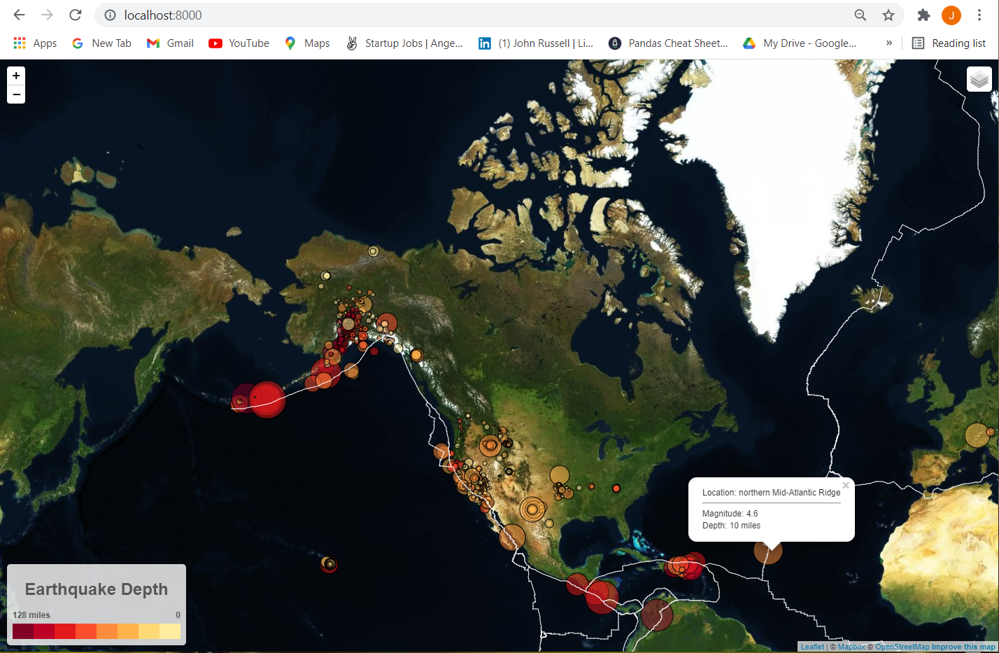

## Table of contents
* [General info](#general-info)
* [Approach](#approach)
* [Technologies](#technologies)
* [ScreenShots](#screenshots)
* [Setup](#setup)

## General info
The United States Geological Survey (USGS) is responsible for providing scientific data about natural hazards, the health of our ecosystems and environment; and the impacts of climate and land-use change. Their scientists develop new methods and tools to supply timely, relevant, and useful information about the Earth and its processes. The USGS provides earthquake data in a number of different formats, updated every 5 minutes at http://earthquake.usgs.gov/earthquakes/feed/v1.0/geojson.php). 

This visualization uses global earthquakes in the last 7 days (all magnitudes).

## Approach

Step-1

A map was created using leaflet.js that plots all of the earthquakes from the data set based on their longitude and latitude.  

Data markers reflect the magnitude of the earthquake by their size (I chose the square of the magnitude to emphasize larger quakes knowing that in reality the relative difference is far larger). Depth of the earth quake is represented by color (in some cases the depth data was a negative value sometimes a positive, so the absolute value was used. So earthquakes with higher magnitudes appear larger and earthquakes with greater depth appear darker in color in the plot.
Popups are provided that give additional information (location, depth and magnitude) about the earthquake when a marker is clicked.
A legend that provides context on the depth/color scale was added.  

Step-2

A second geoJSON file describing the global tectonic plate boundaries was obtained at https://github.com/fraxen/tectonicplates.  

The above second data set was plotted on the map to illustrate the relationship between tectonic plates and seismic activity. A number of base maps were added as well as separating out the two different data sets into overlays that can be turned on and off independently.   As expected there appears to be a strong visual correlation between earthquake locations and specific tectonic plates boundary locations.
	
## Technologies
The visualization is created with:
* HTML, JavaScript, CSS
* Mapbox
* leaflet.js a JavaScript library
* Data from the USGS and tectonic plate boundary JSON files from https://github.com/fraxen/tectonicplates.

## ScreenShots

## Setup
To run this project, download it locally from github:

In bash:
"""
	$ git clone git@github.com:jwr1969/leaflet-challenge.git
	$ cd Leaflet-Step-2/
	$ python -m http.server

	In your web browser:

	localhost:8000
"""

John Russell
07/07/2021

